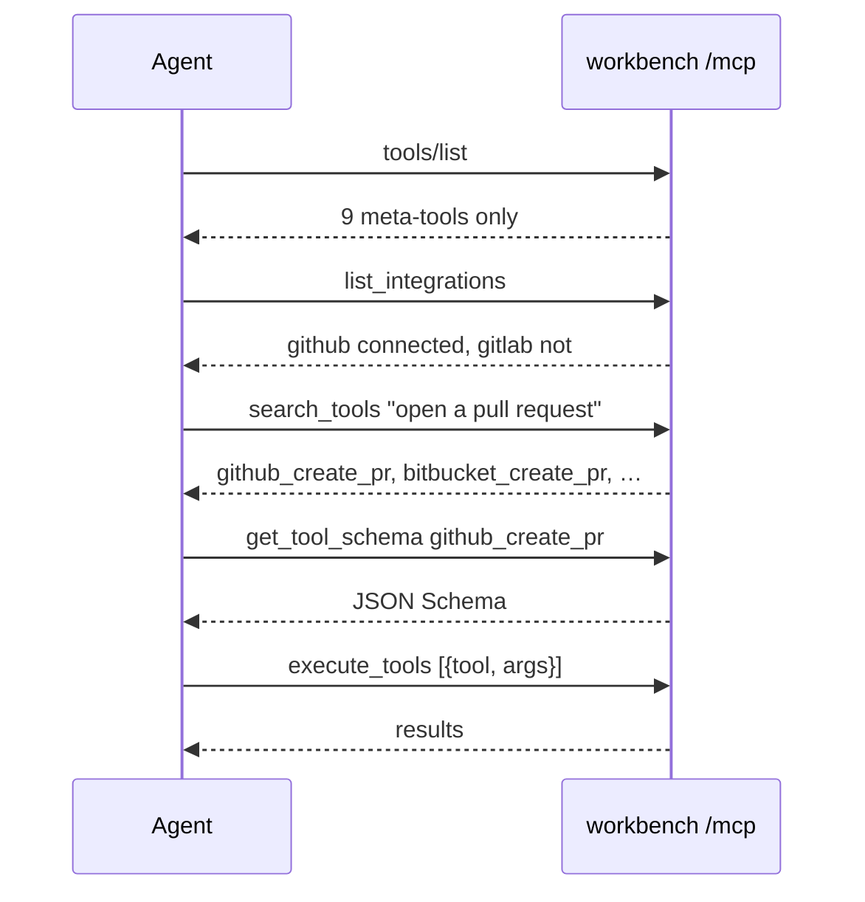

A stock workbench install loads 16 plugins with 194 tools, plus 12 more from the two
built-in integrations. If the MCP endpoint listed all of them, every conversation would
start by burning tens of thousands of tokens on schemas the agent will never call — and
most clients degrade badly once a tool list gets long.

So `tools/list` returns exactly nine tools, ever. They are the *meta-tools*: a fixed,
small surface through which every plugin tool is reached. Three of them cover discovery.

| Meta-tool | Answers |
|---|---|
| `list_integrations` | Which services exist, and am I connected to them? |
| `search_tools` | Which tools fit this task? |
| `get_tool_schema` | What arguments does this one tool take? |

The pattern is: narrow by integration or keyword, fetch one schema, then
[execute](executing-tools.md). Nothing loads a schema you did not ask for.

## list_integrations

Takes no arguments. Returns every registered integration and whether the calling user
has a working credential for it.

```json
{"jsonrpc":"2.0","id":1,"method":"tools/call",
 "params":{"name":"list_integrations","arguments":{}}}
```

```json
{
  "integrations": [
    { "name": "github",   "version": "1.0.0", "connected": true },
    { "name": "gitlab",   "version": "1.0.0", "connected": false },
    { "name": "browser",  "version": "1.0.0", "connected": true },
    { "name": "jots",     "version": "1.0.0", "connected": true }
  ]
}
```

`connected` is computed per auth type, not read from a flag:

| Auth type | `connected` means |
|---|---|
| `none` | always `true` — built-ins like `browser` and `jots` need no credential |
| `cookie` | a stored cookie bundle exists **and** at least one cookie is unexpired |
| everything else | a stored access token exists |

That is the same check `execute_tools` runs before a handler, so a `false` here predicts
a `NOT_CONNECTED` error there.

The MCP response is deliberately thin — `name`, `version`, `connected` only. Display
names, logos, categories and tool counts come from the portal API
(`GET /api/integrations`), not from this tool.

## search_tools

Takes a required `query` string and an optional `limit` (default 10, max 50). Returns the
best-matching tools first, each with its description, owning integration and a relevance
`score`.

```json
{"jsonrpc":"2.0","id":2,"method":"tools/call",
 "params":{"name":"search_tools","arguments":{"query":"open a pull request"}}}
```

```json
{
  "tools": [
    {
      "name": "github_create_pr",
      "description": "Open a GitHub pull request from head branch into base branch. …",
      "integration": "github",
      "score": 24.5
    },
    {
      "name": "bitbucket_create_pr",
      "description": "Create a Bitbucket pull request from sourceBranch into destinationBranch …",
      "integration": "atlassian-bitbucket",
      "score": 23.74
    }
  ]
}
```

Descriptions come back in full — several shipped tools carry a paragraph explaining
follow-up tools and traps. They are abbreviated here.

### How matching works

Write the query the way you would describe the task: `"create jira issue"`,
`"send email"`, `"list github pull requests"`.

- **Words, in any order.** The query and each tool's name, integration and description are
  split into words (`jira_create_issue` → jira, create, issue), stop words dropped, plurals
  and `-ed`/`-ing` folded. `"issue create jira"` finds the same tool.
- **Forgiving.** A word matches exactly, by prefix (`"calend"`), or by a common synonym
  (`"ticket"` → issue, `"email"` → gmail, `"pull request"` ↔ `pr`).
- **Typos are corrected first.** A word no tool uses is corrected to the nearest word
  that one does (one edit for words of 4+ letters, two for 8+; a swapped pair counts as
  one), then matched by the rules above at a discount. `"emial"` becomes `email`, which
  also reaches `gmail` by synonym, so `"send emial"` ranks like `"send email"`, a little
  lower. A real word is never corrected, so `"gitlab"` stays `gitlab`.
- **Ranked.** A word in the tool name counts more than one in the integration, and both
  more than one in the description. Rare words count more than common ones. A tool that
  matches every word beats one that matches a few, and an exact tool name comes first.
- **Capped.** The top 10 come back by default; pass `limit` (up to 50) for more. To see
  one plugin's whole surface, search its name with a higher limit (`"gitlab"`, `limit: 50`).

Built-in and custom-app tools are ranked together. The `score` only orders one result
list; do not compare it across queries.

> [!NOTE] Tool names are one flat namespace
> The registry keys tools by name across all plugins, and a later-loaded plugin
> silently overwrites an earlier one with the same tool name. That is why every shipped
> plugin prefixes its tools with its own slug (`github_`, `jira_`, `slack_`).

## get_tool_schema

Takes one required `tool` name and returns that tool's argument schema.

```json
{"jsonrpc":"2.0","id":3,"method":"tools/call",
 "params":{"name":"get_tool_schema","arguments":{"tool":"github_list_prs"}}}
```

```json
{
  "schema": {
    "type": "object",
    "properties": {
      "owner":   { "type": "string" },
      "repo":    { "type": "string" },
      "state":   { "type": "string", "enum": ["open", "closed", "all"], "default": "open" },
      "perPage": { "type": "number", "default": 10 },
      "page":    { "type": "number", "default": 1 }
    },
    "required": ["owner", "repo"],
    "additionalProperties": false,
    "$schema": "http://json-schema.org/draft-07/schema#"
  }
}
```

Plugins define their schemas in Zod. This tool converts them to portable JSON Schema so
a client needs no Zod knowledge. Defaults survive the conversion, and they are real —
`execute_tools` validates against the same Zod schema before calling the handler, so an
omitted `state` genuinely arrives as `"open"` rather than `undefined`.

An unknown name returns `{"error": "Tool not found"}` — a successful JSON-RPC result
containing an error object, not a protocol error.

## The 60,000-character cap

Every `tools/call` result is JSON-stringified into a single text block and capped at
**60,000 characters**. Past that, the text is truncated and a notice is appended:

```
…[result truncated: 214883 chars total, showing first 60000. Narrow the request (limit/fields/pagination) to get complete data.]
```

This exists because plugin handlers mostly pass upstream API responses through
untouched, and one unbounded list call can otherwise blow out the caller's context
window.

> [!WARNING] Truncated output is not valid JSON
> The cap slices the string mid-structure on purpose. Do not try to repair or re-parse
> it — treat the notice as an instruction and reissue the call with a `limit`, a field
> selection, or pagination.

The cap applies to discovery too. A `search_tools` call with a high `limit` and tools
that carry long descriptions can hit it. One exception: if a result carries an `_mcpImage` sentinel
(a screenshot, say), the content becomes image blocks instead and the text block is
dropped entirely.

## Putting it together



Next: [Executing tools](executing-tools.md) covers the batch call, the per-execution
lifecycle, and the exact error shapes.
