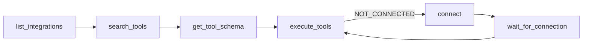

`tools/list` on `/mcp` returns exactly nine tools, no matter how many plugin tools
are loaded. Everything else — all 194 plugin tools and the 12 built-in tools — is
reached through these nine. That is the whole point of the design: your agent's
context holds nine schemas instead of 206.

There is no `execute_tool` (singular). Single execution is `execute_tools` with a
one-element `executions` array.

The normal sequence is discover, then inspect, then run:



## search_tools

Search every tool the caller can run — built-in plugin tools and their own custom
apps — and get the best matches first. This is the entry point — plugin tools never
appear in `tools/list`, so this is how an agent learns that `jira_create_issue` exists.

**Description as the client sees it:** *Search available tools by what you want to do, e.g. "create jira issue" or "send email". Matches words in any order, tolerates typos and common synonyms, and returns the best matches first with a relevance score. Returns the top 10 by default; pass limit (max 50) for more.*

| Parameter | Type | Required | Default | Description |
|---|---|---|---|---|
| `query` | string | yes | — | What you want to do, in words |
| `limit` | integer | no | 10 | Maximum number of tools to return (1–50) |

Returns `{ tools: [{ name, description, integration, score }] }`, best first. The
entry's `integration` is the owning plugin. Pass it to `connect` if execution later
reports `NOT_CONNECTED`. How matching and ranking work: [Discovering tools](../guides/discovering-tools.md#how-matching-works).

```json
{ "name": "search_tools", "arguments": { "query": "create jira issue" } }
```

## get_tool_schema

Fetch one tool's input schema, converted from the plugin's Zod schema to portable
JSON Schema so any MCP client can read it without Zod. A non-Zod schema passes
through unchanged.

**Description as the client sees it:** *Get input schema for a specific tool*

| Parameter | Type | Required | Default | Description |
|---|---|---|---|---|
| `tool` | string | yes | — | Tool name |

Returns `{ schema: <JSON Schema> }`, or `{ error: "Tool not found" }` for an
unknown name.

```json
{ "name": "get_tool_schema", "arguments": { "tool": "github_create_pr" } }
```

## execute_tools

Run one or more plugin tools. This is the only execution path.

**Description as the client sees it:** *Execute one or more tools in a single call.
Runs them concurrently (bounded) and returns a `results` array in the same order as
`executions`. A single tool failing does not abort the others — its entry carries an
`error` instead of a `result`. For a single tool, pass a one-element `executions`
array.* The description goes on to explain `compose: true` (below).

| Parameter | Type | Required | Default | Description |
|---|---|---|---|---|
| `executions` | array of objects, min 1 | yes | — | Tools to run; results are returned in this same order |
| `executions[].id` | string, JS identifier | with `compose` | — | Name later steps use to read this result; unique |
| `executions[].tool` | string | yes | — | Tool name returned by `search_tools` |
| `executions[].args` | object | no | `{}` | Arguments for the tool |
| `compose` | boolean | no | `false` | Run in order and pass results between steps — see [compose mode](#compose-mode) |
| `return` | any JSON | with `compose` | — | Template of what to send back; rejected without `compose: true` |

Returns `{ results: [...] }`, index-aligned with `executions`. Each entry is either
`{ result }` on success or an error object. A batch runs through a bounded worker
pool with a concurrency of 8. The server preserves ordering regardless of completion order.

Three error shapes can appear inside `results`:

| Shape | Cause |
|---|---|
| `{ error: "Tool not found" }` | No tool registered under that name |
| `{ error: "NOT_CONNECTED", integration, message }` | The owning integration has no stored credential — call `connect(integration)` |
| `{ error: "<message>" }` | Argument validation failed, or the plugin handler threw |

Arguments are validated against the plugin tool's own Zod schema before the handler
runs, which is what applies the schema's `.default()` values.

```json
{
  "name": "execute_tools",
  "arguments": {
    "executions": [
      { "tool": "github_list_prs", "args": { "owner": "acme", "repo": "demo-repo" } },
      { "tool": "slack_send_message", "args": { "channel": "C123", "text": "PRs listed" } }
    ]
  }
}
```

> [!WARNING] A failing tool still returns JSON-RPC success
> Only protocol errors (unknown meta-tool, bad meta-tool arguments) come back in the
> JSON-RPC `error` field. A plugin tool that doesn't exist, isn't connected, or
> throws arrives as a successful result whose text content contains
> `{"results":[{"error": ...}]}`. A client that inspects only the JSON-RPC `error`
> field will read every tool failure as a success.

### Compose mode

With `compose: true`, `executions` run **in order** and each step can read earlier
results. Use it when the interesting part of a workflow is the *pointer* at the end
— a file id, a row count, a URL — and the payload in the middle (a CSV body, file
content, raw bytes) would only burn context or trip the 60,000-character result cap.

A reference is `{{step:<id>.<path>}}`, the same `{{namespace:…}}` shape as
[`{{vault:NAME}}`](../integrations/vault.md). Path segments are keys or array indexes
(`{{step:list.files.0.id}}`); refs work at any depth inside `args`.

- **Whole value** — `"{{step:export.row_count}}"` is replaced by the value itself,
  keeping its type (number, object, array).
- **Embedded** — `"Review: {{step:pr.title}}"` interpolates; a non-string value is
  inserted as JSON.
- **Malformed** — anything that opens `{{step:` but doesn't parse (`"{{step:a.csv.}}"`)
  is rejected as `BAD_REF`, never passed to the tool as a literal.

`return` is a template resolved the same way, and its shape is the response shape:
a single ref returns one value, an object returns an object with your keys, an
array returns an array.

Each step goes through the same path as a plain `execute_tools` item: connection
check, Zod validation, audit row, result scrubbing. A step that fails ends the run;
later steps do not run.

> [!IMPORTANT] Vault refs resolve against what the agent wrote, never against a step result
> `{{vault:NAME}}` and `{{step:…}}` in a step's `args` are substituted in one pass
> over the agent's own template. A value inserted from an earlier step is not
> scanned again, so tool output that happens to contain the text `{{vault:x}}` (a
> PR title, a CSV cell) reaches the next tool as that literal text, not the secret.
> `return` never resolves vault refs at all, and neither do `vault_*` tools or
> custom-app tools (their results are not scrubbed).

Returns `{ result: <resolved return> }`. Errors:

| Shape | Cause |
|---|---|
| `compose: true requires return` | `return` missing |
| `return requires compose: true` | `return` sent without `compose` |
| `{ error: "Invalid step id '<id>'" }` / `{ error: "Duplicate step id '<id>'" }` | Missing, non-identifier, or repeated `id` |
| `{ error: "BAD_REF: unknown step '<id>'", step }` | A ref names a step that doesn't exist or hasn't run yet |
| `{ error: "BAD_REF: missing '<id>.<path>'", step }` | The step ran but has no value at that path |
| `{ error: "BAD_REF: malformed ref in '<value>'", step }` | Opens `{{step:` but isn't a valid ref |
| `{ error, step, ... }` | A step failed; `step` is its id, the rest is that step's own error |

`step` is absent when the bad ref is in `return`.

```json
{
  "name": "execute_tools",
  "arguments": {
    "compose": true,
    "executions": [
      { "id": "export", "tool": "superset_export_csv", "args": { "sql": "SELECT …" } },
      { "id": "upload", "tool": "google_drive_upload",
        "args": { "name": "{{step:export.filename}}", "content": "{{step:export.csv}}" } }
    ],
    "return": {
      "file_id": "{{step:upload.id}}",
      "link": "{{step:upload.webViewLink}}",
      "rows": "{{step:export.row_count}}"
    }
  }
}
```

Response: `{ "result": { "file_id": "…", "link": "…", "rows": 1200 } }` — the CSV
never appears.

Compose is MCP-only for now: the REST batch form (`POST /rest/:integration` with
`executions`) does not accept `compose`.

## whoami

Return the authenticated workbench user behind the current request. Identity only —
it says nothing about which integrations are connected.

**Description as the client sees it:** *Return the current authenticated workbench
user (id + email). Like /me — identity only, not connected integrations.*

No parameters.

Returns `{ id, email }`, or `{ error: "User not found" }`.

```json
{ "name": "whoami", "arguments": {} }
```

## list_integrations

List every registered integration and whether this user is connected to it.

**Description as the client sees it:** *List all available integrations and
connection status*

No parameters.

Returns `{ integrations: [{ name, version, connected }] }`. `connected` is `true`
for `auth.type: "none"` integrations, a live-cookie check for cookie integrations,
and "a stored token exists" for everything else.

This is deliberately leaner than the portal's `/api/integrations` — it carries no
`displayName`, `logo`, `authType`, or `toolCount`.

```json
{ "name": "list_integrations", "arguments": {} }
```

## connect

Begin connecting an integration and get back a workbench link for the user to open.

**Description as the client sees it:** *Begin connecting an integration. Returns a
connectionId and a workbench URL for the user to open. The user must be signed in
to workbench as the same account this agent is connected to; the link will not
work for anyone else. Call wait_for_connection afterward.*

| Parameter | Type | Required | Default | Description |
|---|---|---|---|---|
| `integration` | string | yes | — | Integration name |

Response depends on the integration's declared auth type:

| Auth type | Response |
|---|---|
| `oauth2` | `{ connectionId, type: "oauth2", url }` — `url` is a workbench link, `<PORTAL_URL>/connect/<integration>?t=<jwt>` |
| `cookie` | `{ connectionId, type: "cookie", url }` — same workbench link shape as oauth2 |
| `none` | `{ error: "<name> is built-in and always connected — no connect needed." }` |
| unknown | `{ error: "Integration not found" }` |

For both auth types `url` only ever points back at workbench. Minting it does not
contact the provider and does not warm a browser session — neither the provider
consent URL nor the browser session is built until the link is redeemed. The
pending record lives for `CONNECT_TTL_SECONDS` (default 600).

> [!NOTE] A connect link only works for the account it was minted for
> The link names the workbench user the agent is connected to. Whoever opens it
> must be signed in to workbench as that same user. A different signed-in user
> gets a mismatch page and cannot proceed, so a forwarded link cannot attach
> someone else's credential to this account.

> [!NOTE] API-key integrations do not connect from the agent
> `connect` has no `apikey` branch. An API-key integration falls into the OAuth path
> and errors. Connect those from the portal instead — see
> [API-key connections](../guides/api-key-connections.md).

```json
{ "name": "connect", "arguments": { "integration": "github" } }
```

## wait_for_connection

Block until a connection started by `connect` finishes, so the agent can resume
without polling logic of its own.

**Description as the client sees it:** *Block until a connection started by connect()
completes. Returns status CONNECTED, TIMEOUT, or EXPIRED.*

| Parameter | Type | Required | Default | Description |
|---|---|---|---|---|
| `connectionId` | string | yes | — | ID returned by `connect()` |
| `timeoutSec` | number (positive integer, max 900) | no | `300` | Max seconds to wait |

Returns `{ status: "CONNECTED" }`, `{ status: "EXPIRED" }`, `{ status: "TIMEOUT" }`,
or `{ error: "Unknown connectionId" }`. It polls once per second. On timeout it reaps
the pending record before returning.

A `connectionId` belonging to a different user returns the same
`Unknown connectionId` shape as one that never existed — there is no existence
oracle.

```json
{ "name": "wait_for_connection", "arguments": { "connectionId": "…", "timeoutSec": 600 } }
```

## get_auth_url

Deprecated alias of `connect`, kept for older clients. Same parameters, same handler,
same responses.

**Description as the client sees it:** *Deprecated alias of connect(). Get a URL to
connect an integration.*

| Parameter | Type | Required | Default | Description |
|---|---|---|---|---|
| `integration` | string | yes | — | Integration name |

Prefer `connect` in new code.

## curl_session

Mint a short-lived proxy token that lets the agent make arbitrary HTTP calls against
the named integrations through [the curl proxy](http-api.md), which injects the
user's real credential.

**Description as the client sees it** (verbatim — the risk language is part of the
schema an agent reads): *HIGH RISK — do not call without explicit user approval.
Mints a short-lived proxy token (15 min by default; set expiresInSeconds for 60s–1h,
and ask for no longer than the task needs) granting ARBITRARY API calls
(GET/POST/PUT/PATCH/DELETE), including destructive writes, against the listed
integration(s) — the proxy injects the user's real credential transparently at
/c/&lt;integration&gt;/&lt;path&gt;, so anything reachable via that credential is
reachable through this token. Before invoking, tell the user exactly which
integration(s) and what action you intend to perform, and wait for their explicit
go-ahead; do not mint speculatively or as a default first step. Only integrations
that have curl proxy enabled are accepted.*

| Parameter | Type | Required | Default | Description |
|---|---|---|---|---|
| `integrations` | array of strings, min 1 | yes | — | Integration names to include in the session |
| `expiresInSeconds` | integer, 60–3600 | no | `900` | Token lifetime in seconds. Out of range or fractional values fail validation |

On success:

```json
{
  "token": "<jwt>",
  "expiresIn": 900,
  "proxyBaseUrl": "https://workbench.example.com/c",
  "usage": "Send requests to https://workbench.example.com/c/<integration>/<path> with Authorization: Bearer <token>"
}
```

`expiresIn` echoes the lifetime of the minted token: `expiresInSeconds`, or 900 when it is omitted.

Validation is all-or-nothing. Every name is checked, and if any fail the whole call
returns `{ error }` with the failures joined by `; `:

| Error fragment | Cause |
|---|---|
| `<name>: integration not found` | No such integration |
| `<name>: curl proxy not enabled` | The manifest has no `proxy` block |
| `<name>: not connected` | No stored credential for this user |

> [!DANGER] This token can do anything the user's credential can do
> Anything the stored credential can reach — including destructive writes — is
> reachable with this token until it expires — up to an hour. Ask the user before minting one, name the
> integrations and the intended action, and do not mint speculatively.

```json
{ "name": "curl_session", "arguments": { "integrations": ["github"] } }
```
